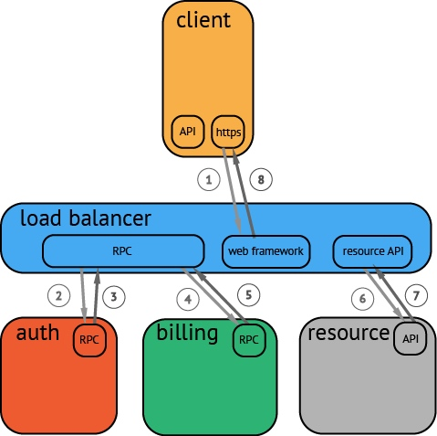
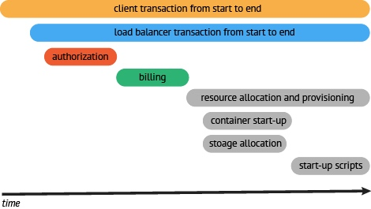
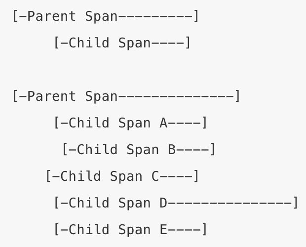
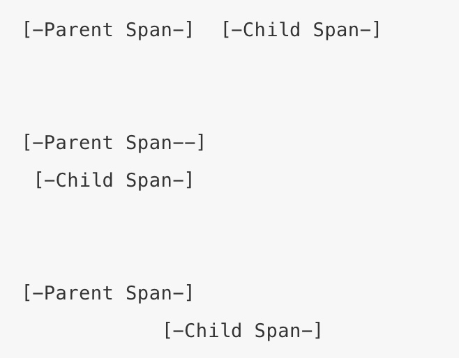
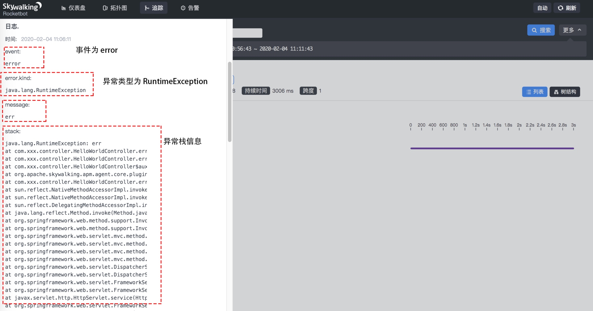
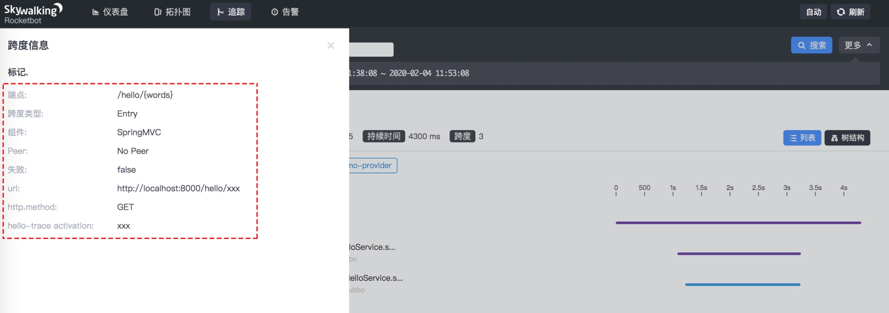

# skywalking-demo
skywalking demo

## 1 Trace简介
一个 Trace 代表一个事务、请求或是流程在分布式系统中的执行过程。OpenTracing 中的一条 Trace 被认为是一个由多个 Span 组成的有向无环图（ DAG 图），一个 Span 代表系统中具有开始时间和执行时长的逻辑单元，Span 一般会有一个名称，一条 Trace 中 Span 是首尾连接的。

## 2 Span简介
Span 代表系统中具有开始时间和执行时长的逻辑单元，Span 之间通过嵌套或者顺序排列建立逻辑因果关系。

每个 Span 中可以包含以下的信息：

操作名称：例如访问的具体 RPC 服务，访问的 URL 地址等；

起始时间；

结束时间；

Span Tag：一组键值对构成的 Span 标签集合，其中键必须为字符串类型，值可以是字符串、bool 值或者数字；

Span Log：一组 Span 的日志集合；

SpanContext：Trace 的全局上下文信息；

References：Span 之间的引用关系，下面详细说明 Span 之间的引用关系；

在一个 Trace 中，一个 Span 可以和一个或者多个 Span 间存在因果关系。目前，OpenTracing 定义了 ChildOf 和 FollowsFrom 两种 Span 之间的引用关系。这两种引用类型代表了子节点和父节点间的直接因果关系。

ChildOf 关系：一个 Span 可能是一个父级 Span 的孩子，即为 ChildOf 关系。下面这些情况会构成 ChildOf 关系：

一个 HTTP 请求之中，被调用的服务端产生的 Span，与发起调用的客户端产生的 Span，就构成了 ChildOf 关系；

一个 SQL Insert 操作的 Span，和 ORM 的 save 方法的 Span 构成 ChildOf 关系。

FollowsFrom 关系：在分布式系统中，一些上游系统（父节点）不以任何方式依赖下游系统（子节点）的执行结果，例如，上游系统通过消息队列向下游系统发送消息。这种情况下，下游系统对应的子 Span 和上游系统对应的父级 Span 之间是 FollowsFrom 关系。下图展示了一些可能的 FollowsFrom 关系：

## 3 Logs 简介
每个 Span 可以进行多次 Logs 操作，每一次 Logs 操作，都需要带一个时间戳，以及一个可选的附加信息

## 4 Tags 简介
每个 Span 可以有多个键值对形式的 Tags，Tags 是没有时间戳的，只是为 Span 添加一些简单解释和补充信息。下图展示了前文示例中 Tags 的信息：

## 5 SpanContext 和 Baggage
SpanContext 表示进程边界，在跨进调用时需要将一些全局信息，例如，TraceId、当前 SpanId 等信息封装到 Baggage 中传递到另一个进程（下游系统）中。

Baggage 是存储在 SpanContext 中的一个键值对集合。它会在一条 Trace 中全局传输，该 Trace 中的所有 Span 都可以获取到其中的信息。

需要注意的是，由于 Baggage 需要跨进程全局传输，就会涉及相关数据的序列化和反序列化操作，如果在 Baggage 中存放过多的数据，就会导致序列化和反序列化操作耗时变长，使整个系统的 RPC 的延迟增加、吞吐量下降。

虽然 Baggage 与 Span Tags 一样，都是键值对集合，但两者最大区别在于 Span Tags 中的信息不会跨进程传输，而 Baggage 需要全局传输。因此，OpenTracing 要求实现提供 Inject 和 Extract 两种操作，SpanContext 可以通过 Inject 操作向 Baggage 中添加键值对数据，通过 Extract 从 Baggage 中获取键值对数据。

## 6核心接口语义
OpenTracing 希望各个实现平台能够根据上述的核心概念来建模实现，不仅如此，OpenTracing 还提供了核心接口的描述，帮助开发人员更好的实现 OpenTracing 规范。

Span 接口

Span接口必须实现以下的功能：

获取关联的 SpanContext：通过 Span 获取关联的 SpanContext 对象。

关闭（Finish）Span：完成已经开始的 Span。

添加 Span Tag：为 Span 添加 Tag 键值对。

添加 Log：为 Span 增加一个 Log 事件。

添加 Baggage Item：向 Baggage 中添加一组键值对。

获取 Baggage Item：根据 Key 获取 Baggage 中的元素。

SpanContext 接口

SpanContext 接口必须实现以下功能，用户可以通过 Span 实例或者 Tracer 的 Extract 能力获取 SpanContext 接口实例。

遍历 Baggage 中全部的 KV。

Tracer 接口

Tracer 接口必须实现以下功能：

创建 Span：创建新的 Span。

注入 SpanContext：主要是将跨进程调用携带的 Baggage 数据记录到当前 SpanContext 中。

提取 SpanContext ，主要是将当前 SpanContext 中的全局信息提取出来，封装成 Baggage 用于后续的跨进程调用。

## 7 JDK SPI（Service Provider Interface） 机制
当服务的提供者提供了一种接口的实现之后，需要在 Classpath 下的 META-INF/services/ 目录里创建一个以服务接口命名的文件，此文件记录了该 jar 包提供的服务接口的具体实现类。当某个应用引入了该 jar 包且需要使用该服务时，JDK SPI 机制就可以通过查找这个 jar 包的 META-INF/services/ 中的配置文件来获得具体的实现类名，进行实现类的加载和实例化，最终使用该实现类完成业务功能
