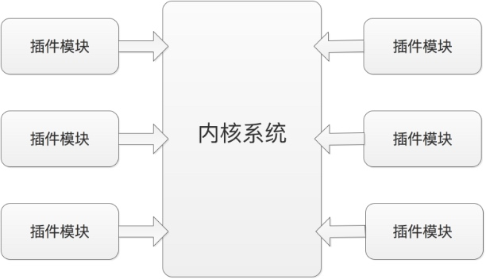
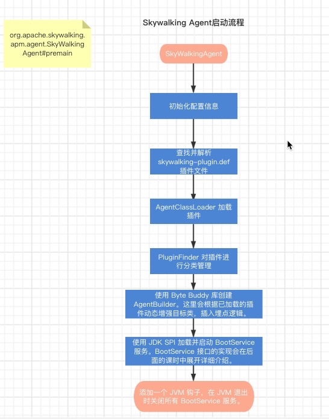

# skywalking-demo
skywalking demo

## 1 Trace简介
一个 Trace 代表一个事务、请求或是流程在分布式系统中的执行过程。OpenTracing 中的一条 Trace 被认为是一个由多个 Span 组成的有向无环图（ DAG 图），一个 Span 代表系统中具有开始时间和执行时长的逻辑单元，Span 一般会有一个名称，一条 Trace 中 Span 是首尾连接的。


## 2 Span简介
Span 代表系统中具有开始时间和执行时长的逻辑单元，Span 之间通过嵌套或者顺序排列建立逻辑因果关系。

每个 Span 中可以包含以下的信息：

操作名称：例如访问的具体 RPC 服务，访问的 URL 地址等；

起始时间；

结束时间；

Span Tag：一组键值对构成的 Span 标签集合，其中键必须为字符串类型，值可以是字符串、bool 值或者数字；

Span Log：一组 Span 的日志集合；

SpanContext：Trace 的全局上下文信息；

References：Span 之间的引用关系，下面详细说明 Span 之间的引用关系；

在一个 Trace 中，一个 Span 可以和一个或者多个 Span 间存在因果关系。目前，OpenTracing 定义了 ChildOf 和 FollowsFrom 两种 Span 之间的引用关系。这两种引用类型代表了子节点和父节点间的直接因果关系。

ChildOf 关系：一个 Span 可能是一个父级 Span 的孩子，即为 ChildOf 关系。下面这些情况会构成 ChildOf 关系：

一个 HTTP 请求之中，被调用的服务端产生的 Span，与发起调用的客户端产生的 Span，就构成了 ChildOf 关系；

一个 SQL Insert 操作的 Span，和 ORM 的 save 方法的 Span 构成 ChildOf 关系。


FollowsFrom 关系：在分布式系统中，一些上游系统（父节点）不以任何方式依赖下游系统（子节点）的执行结果，例如，上游系统通过消息队列向下游系统发送消息。这种情况下，下游系统对应的子 Span 和上游系统对应的父级 Span 之间是 FollowsFrom 关系。下图展示了一些可能的 FollowsFrom 关系：


## 3 Logs 简介
每个 Span 可以进行多次 Logs 操作，每一次 Logs 操作，都需要带一个时间戳，以及一个可选的附加信息


## 4 Tags 简介
每个 Span 可以有多个键值对形式的 Tags，Tags 是没有时间戳的，只是为 Span 添加一些简单解释和补充信息。下图展示了前文示例中 Tags 的信息：


## 5 SpanContext 和 Baggage
SpanContext 表示进程边界，在跨进调用时需要将一些全局信息，例如，TraceId、当前 SpanId 等信息封装到 Baggage 中传递到另一个进程（下游系统）中。


Baggage 是存储在 SpanContext 中的一个键值对集合。它会在一条 Trace 中全局传输，该 Trace 中的所有 Span 都可以获取到其中的信息。

需要注意的是，由于 Baggage 需要跨进程全局传输，就会涉及相关数据的序列化和反序列化操作，如果在 Baggage 中存放过多的数据，就会导致序列化和反序列化操作耗时变长，使整个系统的 RPC 的延迟增加、吞吐量下降。


虽然 Baggage 与 Span Tags 一样，都是键值对集合，但两者最大区别在于 Span Tags 中的信息不会跨进程传输，而 Baggage 需要全局传输。因此，OpenTracing 要求实现提供 Inject 和 Extract 两种操作，SpanContext 可以通过 Inject 操作向 Baggage 中添加键值对数据，通过 Extract 从 Baggage 中获取键值对数据。

## 6核心接口语义
OpenTracing 希望各个实现平台能够根据上述的核心概念来建模实现，不仅如此，OpenTracing 还提供了核心接口的描述，帮助开发人员更好的实现 OpenTracing 规范。

Span 接口

Span接口必须实现以下的功能：

获取关联的 SpanContext：通过 Span 获取关联的 SpanContext 对象。

关闭（Finish）Span：完成已经开始的 Span。

添加 Span Tag：为 Span 添加 Tag 键值对。

添加 Log：为 Span 增加一个 Log 事件。

添加 Baggage Item：向 Baggage 中添加一组键值对。

获取 Baggage Item：根据 Key 获取 Baggage 中的元素。

SpanContext 接口

SpanContext 接口必须实现以下功能，用户可以通过 Span 实例或者 Tracer 的 Extract 能力获取 SpanContext 接口实例。

遍历 Baggage 中全部的 KV。

Tracer 接口

Tracer 接口必须实现以下功能：

创建 Span：创建新的 Span。

注入 SpanContext：主要是将跨进程调用携带的 Baggage 数据记录到当前 SpanContext 中。

提取 SpanContext ，主要是将当前 SpanContext 中的全局信息提取出来，封装成 Baggage 用于后续的跨进程调用。

## 7 JDK SPI（Service Provider Interface） 机制
当服务的提供者提供了一种接口的实现之后，需要在 Classpath 下的 META-INF/services/ 目录里创建一个以服务接口命名的文件，此文件记录了该 jar 包提供的服务接口的具体实现类。当某个应用引入了该 jar 包且需要使用该服务时，JDK SPI 机制就可以通过查找这个 jar 包的 META-INF/services/ 中的配置文件来获得具体的实现类名，进行实现类的加载和实例化，最终使用该实现类完成业务功能
```
private static final String PREFIX = "META-INF/services/";
java.util.ServiceLoader.LazyIterator#hasNextService()

```


## 8 节点角色

Master Eligible Node （候选主节点）：可以被选举为 Master 的候选节点；
Master Node （主节点）：完成节点发现阶段之后，才会进入主节点选举阶段，为了防止在网络分区的场景下出现脑裂问题，一般采用 quorum 版本的 Bully 算法变体（本课时重点是帮助你快速了解 ElasticSearch 基础知识，不展开该算法的具体原理）。所以，主节点是从候选主节点中选举出来的，主要负责管理 ElasticSearch 集群，通过广播的机制与其他节点维持关系，负责集群中的 DDL 操作（创建/删除索引），管理其他节点上的分片；
Data Node（数据节点）：存放数据的节点，负责数据的增删改查；
Coordinating Node（协调节点）：每个节点都是一个潜在的协调节点，协调节点最大的作用就是响应客户端的请求，将各个分片里的数据汇总起来一并返回给客户端，因此 ElasticSearch 的节点需要有足够的 CPU 和内存资源去处理汇总操作；
Ingest Node（提取节点）：能执行预处理管道，不负责数据也不负责集群相关的事务。


## 9 分片&副本

在 ElasticSearch 中的一个 Index 可以存储海量的 Document，单台机器的磁盘大小是无法存储的，而且在进行数据检索的时候，单台机器也存在性能瓶颈，无法为海量数据提供高效的检索。

为了解决上述问题，ElasticSearch 将单个 Index 分割成多个分片，创建 Index 时，可以按照预估值指定任意数量的分片。虽然逻辑上每个分片都属于一个 Index，但是单个分片都是一个功能齐全且独立的 Index，一个分片可以被分配到集群中的任意节点上。

最后，某条 Document 数据具体存储在哪个分片，完全由 ElasticSearch 的分片机制决定。当写入一条 Document 的时候，ElasticSearch 会根据指定的 key （默认是 ElasticSearch 自动生成的 Id，用户也可以手动指定）决定其所在的分片编号，计算公式如下

`分片编号 = hash(key) % 主分片数量`

单台服务器在实际使用中可能会因为这样或那样的原因发生故障，例如意外断电、系统崩溃、磁盘寿命到期等，这些故障是无法预知的。当发生故障时，该节点负责的分片就无法对外提供服务了，此时需要有一定的容错机制，在发生故障时保证此分片可以继续对外提供服务。

ElasticSearch 提供的副本功能就可以很好的解决这一问题，在副本模式下，每个分片分为主分片和副本分片。

副本带来了两个好处：一个是在主分片出现故障的时候，可以通过副本继续提供服务（所以，分片副本一般不与主分片分配到同一个节点上）；另一个就是查询操作可以在分片副本上执行，因此可以提升整个 ElasticSearch 查询性能。


## 10 ElasticSearch 写入流程简介

分片是 ElasticSearch 中最小的数据分配单位，即一个分片总是作为一个整体被分配到集群中的某个节点。继续深入分片的结构会发现，一个分片是由多个 Segment 构成的，如下图所示：


Segment 是最小的数据存储单元，ElasticSearch 每隔一段时间会产生一个新的 Segment，用于写入最新的数据。旧的 Segment 是不可改变的，只能用于数据查询，是无法继续向其中写入数据的

在很多分布式系统中都能看到类似的设计，这种设计有下面几点好处：

- 旧 Segment 不支持修改，那么在读操作的时候就不需要加锁，省去了锁本身以及竞争锁相关的开销；
- 只有最新的 Segment 支持写入，可以实现顺序写入的效果，增加写入性能；
- 只有最新的 Segment 支持写入，可以更好的利用文件系统的 Cache 进行缓存，提高写入和查询性能。

介绍完分片内部的 Segment 结构之后，接下来简单介绍一下 ElasticSearch 集群处理一个写入请求的大致过程：

写入请求会首先发往协调节点（Coordinating Node），之前提到，协调节点可能是 Client 连接上的任意一个节点，协调节点根据 Document Id 找到对应的主分片所在的节点。

接下来，由主分片所在节点处理写入请求，先是写入 Transaction Log 【很多分布式系统都有 WAL （Write-ahead Log）的概念，可以防止数据丢失】，而后将数据写入内存中，默认情况下每隔一秒会同步到 FileSystem Cache 中，Cache 中的数据在后续查询中已经可以被查询了，默认情况下每隔 30s，会将 FileSystem cache 中的数据写入磁盘中，当然为了降低数据丢失的概率，可以将这个时间缩短，甚至设置成同步的形式，相应地，写入性能也会受到影响。

写入其他副本的方式与写入主分片的方式类似，不再重复。需要注意的是，这里可以设置三种副本写入策略：

- quorum：默认为 quorum 策略，即超过半数副本写入成功之后，相应写入请求即可返回给客户端；
- one ：one 策略是只要成功写入一个副本，即可向客户端返回；
- all：all 策略是要成功写入所有副本之后，才能向客户端返回。

ElasticSearch 的删除操作只是逻辑删除， 在每个 Segment 中都会维护一个 .del 文件，删除操作会将相应 Document 在 .del 文件中标记为已删除，查询时依然可以查到，但是会在结果中将这些"已删除"的 Document 过滤掉。

由于旧 Segment 文件无法修改，ElasticSearch 是无法直接进行修改的，而是引入了版本的概念，它会将旧版本的 Document 在 .del 文件中标记为已删除，而将新版本的 Document 索引到最新的 Segment 中。

另外，随着数据的不断写入，将产生很多小 Segment 文件，ElasticSearch 会定期进行 Segment Merge，从而减少碎片文件，降低文件打开数，提升 I/O 性能。在 Merge 过程中可以同时根据 .del 文件，将被标记的 Document 真正删除，此时才是真正的物理删除。


## 11  ElasticSearch 查询流程简介

读操作分为两个阶段：查询阶段和聚合提取阶段。在查询阶段中，协调节点接受到读请求，并将请求分配到相应的分片上（如果没有特殊指定，请求可能落到主分片，也有可能落到副本分片，由协调节点的负载均衡算法来确定）。默认情况下，每个分片会创建一个固定大小的优先级队列（其中只包含 Document Id 以及 Score，并不包含 Document 的具体内容），并以 Score 进行排序，返回给协调节点。如下图所示：


在聚合阶段中，协调节点会将拿到的全部优先级队列进行合并排序，然后再通过 Document ID 查询对应的 Document ，并将这些 Document 组装到队列里返回给客户端。


##  12 High Level REST Client 入门

ElasticSearch 提供了两种 Java Client，分别是 Low Level REST Client 和 High Level REST Client，两者底层都是通过 HTTP 接口与 ElasticSearch 进行交互的：

- Low Level REST Client 需要使用方自己完成请求的序列化以及响应的反序列化；
- High Level REST Client 是基于 Low Level REST Client 实现的，调用方直接使用特定的请求/响应对象即可完成数据的读写，完全屏蔽了底层协议的细节，无需再关心底层的序列化问题。另外， High Level REST Client 提供的 API 都会有同步和异步( async 开头)两个版本，其中同步方法直接返回相应的 response 对象，异步方法需要添加相应的 Listener 来监听并处理返回结果。

SkyWalking 中提供的 ElasticSearchClient 是对 High Level REST Client 的封装。


##  13 搭建Skywalking源码环境
**Skywalking apm**
```
git clone git@github.com:apache/skywalking.git
git checkout -b v8.7.0 v8.7.0

git submodule init
git submodule update
```
导入 IDEA

更新 submodule

全部 Maven 依赖下载完成后，在 SkyWalking 源码根目录中执行如下两条命令，更新 submodule：

```
 ./mvnw package -Dmaven.test.skip=true -Dcheckstyle.skip=true 
```


需要标记的目录有：
grpc-java and java folders in apm-protocol/apm-network/target/generated-sources/protobuf
grpc-java and java folders in oap-server/server-core/target/generated-sources/protobuf
grpc-java and java folders in oap-server/server-receiver-plugin/receiver-proto/target/generated-sources/fbs
grpc-java and java folders in oap-server/server-receiver-plugin/receiver-proto/target/generated-sources/protobuf
grpc-java and java folders in oap-server/exporter/target/generated-sources/protobuf
grpc-java and java folders in oap-server/server-configuration/grpc-configuration-sync/target/generated-sources/protobuf
grpc-java and java folders in oap-server/server-alarm-plugin/target/generated-sources/protobuf
antlr4 folder in oap-server/oal-grammar/target/generated-sources


**skywalking-java**
git clone https://github.com/apache/skywalking-java.git
cd skywalking-java
If you clone codes from https://github.com/apache/skywalking-java

`git clone https://github.com/apache/skywalking-java.git
cd skywalking-java
./mvnw clean package -Pall -Dmaven.test.skip=true -Dcheckstyle.skip=true`

If you download source codes tar from https://skywalking.apache.org/downloads/
`./mvnw clean package`
The agent binary package is generated in skywalking-agent folder.

Set Generated Source Codes(grpc-java and java folders in apm-protocol/apm-network/target/generated-sources/protobuf) folders if you are using IntelliJ IDE.


Skywalking Agent微内核架构

微内核架构也被称为插件化架构（Plug-in Architecture），是一种面向功能进行拆分的可扩展性架构。





