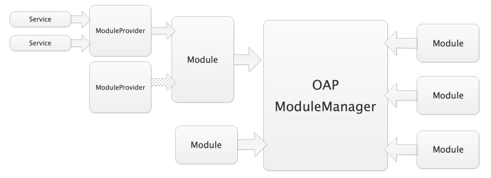
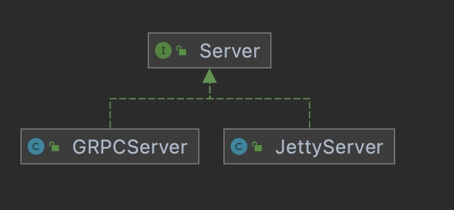
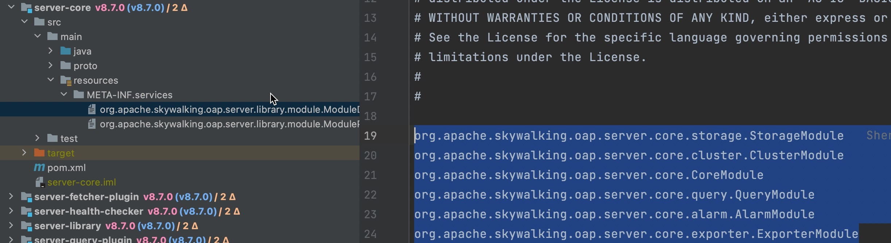
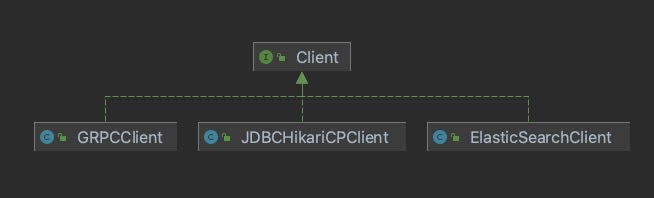

## Skywalking 

### 1、 Server architecture
* 微内核架构（Microkernel Architecture）




* Server interface design



GRPCServer:用于接收Skywalking Agent发送的gRPC请求。
JettyServer:用户从Skywalking Rocketbot界面发起的请求。


* Server Core start process

```
org.apache.skywalking.oap.server.core.storage.StorageModule
org.apache.skywalking.oap.server.core.cluster.ClusterModule
org.apache.skywalking.oap.server.core.CoreModule
org.apache.skywalking.oap.server.core.query.QueryModule
org.apache.skywalking.oap.server.core.alarm.AlarmModule
org.apache.skywalking.oap.server.core.exporter.ExporterModule
```



* DAO层架构



* Server 

### 2、 Server advantages and disadvantages
advantages：
1、plugin（丰富的插件化组件）
2、config（配置化加载组件）

disadvantages：


### 3、 Server optimization

1、针对大流量的应用，查询性能变慢问题
可以优化基于指定应用生成的索引。
2、关于UI，时间插件可以显示在上方。


### Elasticsearch持久化Skywalking数据流程如下：

